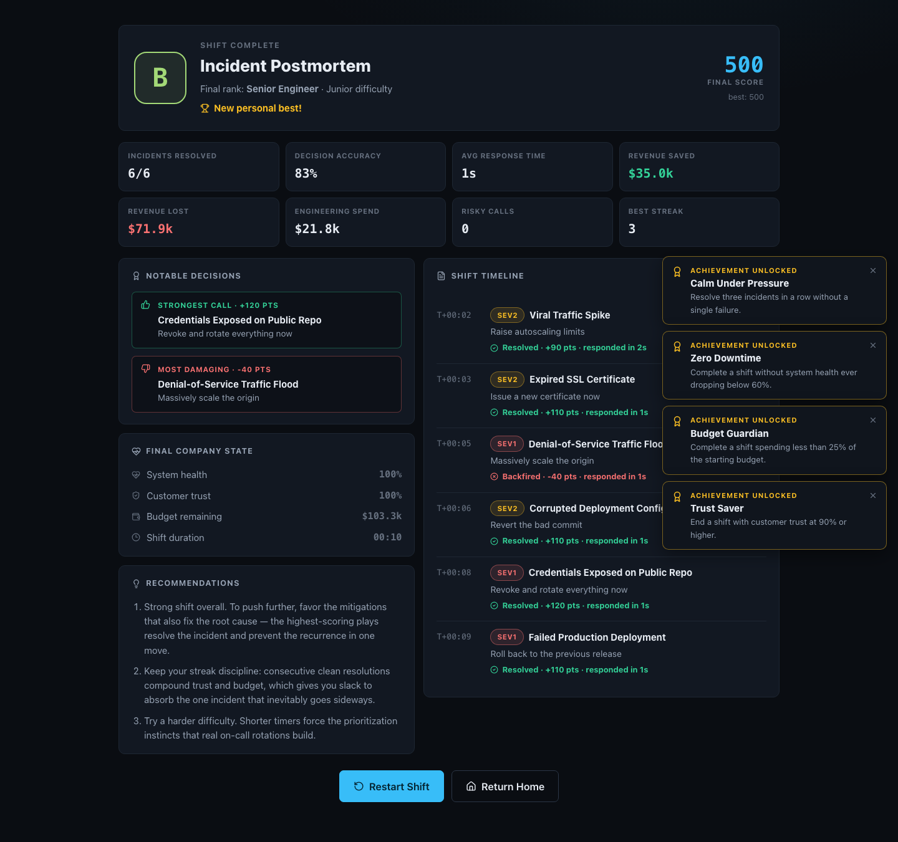

# System Down

An interactive incident-response strategy game where you play as the on-call engineer for a growing software company. Realistic infrastructure incidents appear one at a time, and every decision forces a trade-off between system health, company revenue, customer trust, engineering budget, and response time.

I built System Down as a portfolio project to combine product design, React/TypeScript engineering, and real-world reliability concepts into a polished browser experience — part operations dashboard, part decision-based strategy game.


---

## Overview

In System Down, you work a full on-call shift. Incidents page in with severity labels, alert text, and observable symptoms. You choose how to respond under a countdown timer while the dashboard updates in real time. When the shift ends — either because you finished every incident or because health, trust, or budget collapsed — you get a postmortem report with a grade, engineer rank, timeline, and personalized recommendations.

The game is designed to be understandable to nontechnical players while still using realistic cloud, DevOps, reliability, and incident-management language.

## Gameplay Concept

1. Select a difficulty and start your shift.
2. Read the alert and symptoms for the active incident.
3. Choose one of four responses before the timer expires.
4. Review the outcome: metric changes, score impact, and an engineering explanation.
5. Continue through the remaining incidents.
6. Read your end-of-shift postmortem and try to beat your high score.

If the timer runs out with no response, a failure consequence is applied automatically. One poor decision is rarely fatal — recovery between incidents is intentional — but health, trust, or budget at zero ends the shift early.

## Key Features

- **12 realistic incidents**, including failed production deployments, database overload, payment provider outages, expired SSL certificates, traffic spikes, memory leaks, bad cache invalidation, regional cloud outages, credential exposure, API rate-limit storms, corrupted deployment config, and denial-of-service floods
- **Four actions per incident**, each with risk level, remediation time, and probabilistic success or failure outcomes
- **Delayed consequences** on some choices that surface later in the shift
- **Live operations dashboard** with company metrics (health, trust, revenue, budget, active users, revenue loss rate) and infrastructure telemetry (CPU, memory, DB latency, error rate, request volume, uptime)
- **Countdown pressure** with continuous metric drains while an incident remains unresolved
- **Learning-oriented feedback** after every decision — what happened, why, and what an experienced responder might do
- **Three difficulty levels** that change timers, starting resources, consequence severity, and shift length
- **End-of-shift postmortem** with grade (F–S), rank (Intern → Principal Engineer), accuracy, response time, revenue saved/lost, strongest and most damaging calls, timeline, and recommendations
- **Achievements**, high score, sound preference, and last difficulty saved in `localStorage`
- **Responsive layout** for desktop, tablet, and mobile
- **Keyboard shortcuts** for fast response during incidents
- **No backend** — the entire game runs locally in the browser

## Technologies

| Area | Choice |
| --- | --- |
| UI | React 18 |
| Language | TypeScript (strict) |
| Build tooling | Vite |
| Icons | Lucide React |
| Styling | Custom CSS design system |
| Charts | Lightweight SVG sparklines (no charting library) |
| Persistence | Browser `localStorage` |
| Audio | Web Audio API (synthesized tones, no audio files) |

There is no server, database, authentication, or third-party API dependency.

## Installation

```bash
git clone https://github.com/ManpreetS2/system-down-simulator.git
cd system-down-simulator
npm install
```

## Local Development

```bash
npm run dev
```

Open the URL Vite prints (typically `http://localhost:5173`).

## Production Build

```bash
npm run build
npm run preview
```

`npm run build` type-checks with TypeScript and writes a production bundle to `dist/`.

Optional deterministic engine smoke test:

```bash
npx tsx scripts/engine-smoke.ts
```

## Gameplay Instructions

1. On the start screen, pick **Junior**, **Engineer**, or **Senior**.
2. Review **How to Play** if you are new.
3. Click **Start Shift**.
4. When an incident appears, read the severity, alert, and symptoms.
5. Choose a response (or press `1`–`4`).
6. Read the result panel, then continue to the next incident.
7. After the shift, review the postmortem, restart, or return home.

### Keyboard Controls

| Key | Action |
| --- | --- |
| `1` – `4` | Select response 1–4 during an active incident |
| `Enter` | Continue after a result panel |
| Mouse / touch | Full navigation and all buttons |

### Difficulty Levels

| Difficulty | Shift length | Timer | Pressure |
| --- | --- | --- | --- |
| Junior | 6 incidents | Longer | Softer consequences, more starting budget |
| Engineer | 8 incidents | Balanced | Default balance |
| Senior | 10 incidents | Shorter | Harsher consequences, tighter resources |

## Incident-Response Learning Elements

System Down is intentionally educational as well as playable:

- Correct answers are not always obvious — fast options can be risky; safe options can be slow or expensive
- Result panels explain why a choice worked or failed in plain language
- Each incident includes a recommended experienced-responder approach
- Postmortem recommendations adapt to timeouts, risky play, spend, trust dips, and response speed
- Scenarios cover deployment, databases, security, traffic, third-party vendors, and configuration

## Project Architecture

```
src/
  data/           # Incidents, difficulty configs, achievements (structured content)
  game/           # Reducer engine, report/grading, React hook wiring
  components/     # Start screen, dashboard, incident/result panels, postmortem
  utils/          # Formatting, localStorage helpers, synthesized sound
  types.ts        # Shared TypeScript models
  index.css       # Design system and responsive layout
scripts/
  engine-smoke.ts # Deterministic engine checks (timeouts, game-over, delays)
```

Gameplay content stays in data files. Components render state; the reducer in `src/game/engine.ts` owns timers, metric drains, resolution, delayed consequences, and win/lose conditions. That separation made balancing and adding incidents much easier than burying outcomes inside UI code.

## Screenshots

> Add screenshots after you capture them from a local or deployed run.

| Screen | File |
| --- | --- |
| Start screen | `docs/screenshots/start.png` |
| Active incident dashboard | `docs/screenshots/dashboard.png` |
| Decision result | `docs/screenshots/result.png` |
| End-of-shift postmortem | `docs/screenshots/postmortem.png` |

Place images under `docs/screenshots/` and they will render here:

```markdown



```

## Live Demo

_Coming soon._ After deploying (for example with GitHub Pages, Netlify, or Vercel), replace this section with the public URL.

## What I Learned

- Modeling a full game loop as a single reducer with explicit phases (`idle` → `incident` → `result` → `over`) keeps timing, scoring, and UI state consistent
- Separating incident content from presentation makes balancing and content expansion practical
- Probabilistic outcomes and delayed consequences create replayability without needing a backend
- Building a custom dark operations-center UI required careful hierarchy, severity communication beyond color alone, and responsive stacking instead of shrinking desktop panels
- Cleaning up intervals and guarding against duplicate actions is essential once real-time drains and timers are involved

## Challenges and Design Decisions

- **Balancing difficulty:** One bad call should sting without always ending the run. Between-incident recovery and difficulty multipliers were tuned so Junior feels teachable and Senior feels punishing.
- **Ambiguous choices:** Each incident has a “best practice” path, but high-risk shortcuts sometimes succeed. That mirrors real incident trade-offs without making the right answer a label.
- **Dashboard feel without noise:** Metrics animate and infra values drift, but transitions stay restrained so the interface still reads as a professional command center.
- **Client-only persistence:** High score, achievements, sound, and difficulty use `localStorage` only — enough for portfolio use without accounts or keys.

## Future Improvements

- Incident editor / JSON mod format for community scenarios
- Simultaneous dual-incident triage
- Daily seeded shifts with shareable score cards
- Mid-shift resource spends (contractors, monitoring upgrades)
- Color-blind palette audit and localization
- Markdown export of the shift timeline as a postmortem draft
- Hosted live demo with screenshot assets in the README

## Author

**Manpreet Singh**  
Computer Science Student at De Anza College

Designed and developed as a portfolio project exploring React, TypeScript, state management, interactive game systems, responsive interface design, and incident-response concepts.

## License

This project is licensed under the [MIT License](LICENSE).
