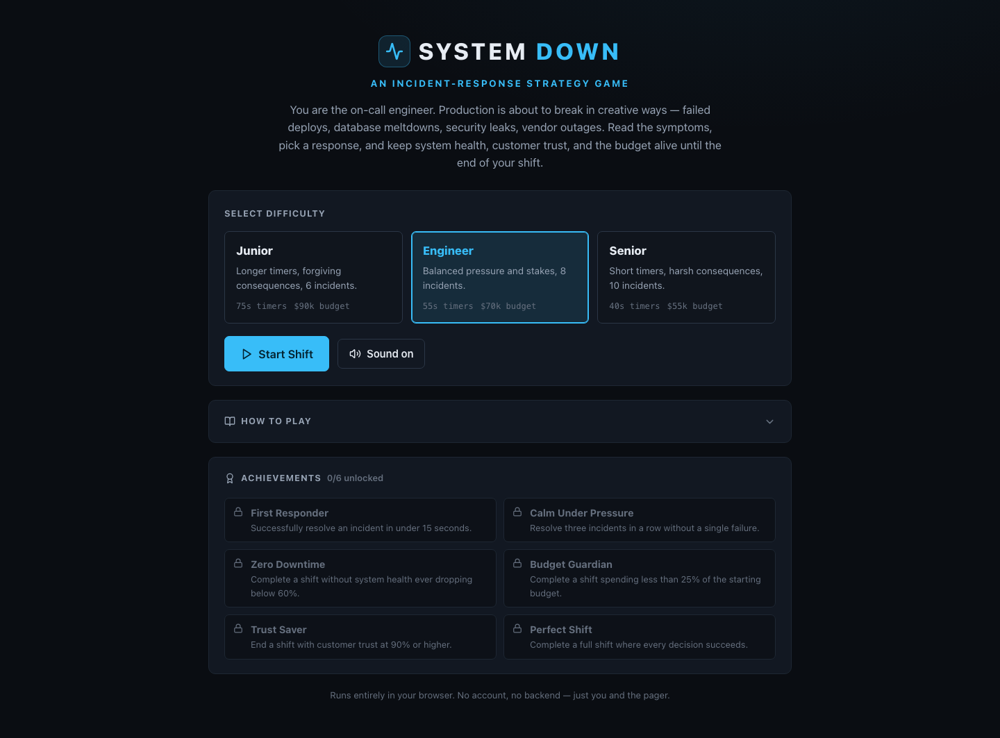
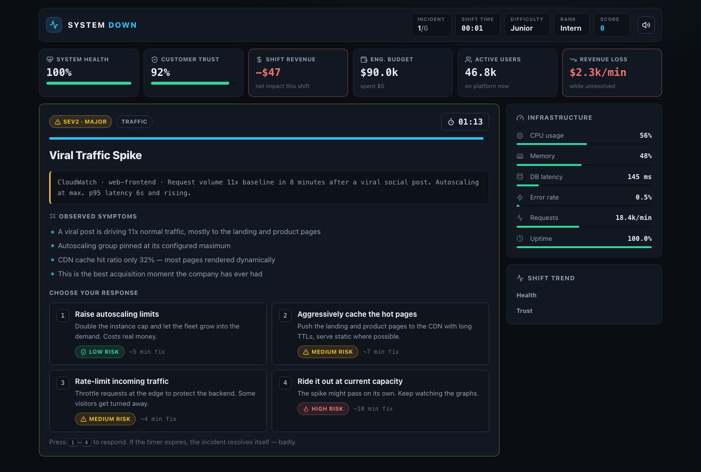

# System Down

[](https://github.com/ManpreetS2/system-down-simulator/actions/workflows/ci.yml)
[](https://github.com/ManpreetS2/system-down-simulator/actions/workflows/deploy-pages.yml)
[](LICENSE)

An interactive incident-response strategy game where you play as the on-call engineer for a growing software company. Realistic infrastructure incidents appear one at a time, and every decision forces a trade-off between system health, company revenue, customer trust, engineering budget, and response time.

**[Play the live demo](https://manpreets2.github.io/system-down-simulator/)**

I built System Down as a portfolio project to combine product design, React/TypeScript engineering, and real-world reliability concepts into a polished browser experience — part operations dashboard, part decision-based strategy game.

## Screenshots

### Start your on-call shift



### Diagnose and respond to live incidents



### Review the final incident postmortem


## Overview

In System Down, you work a full on-call shift. Incidents page in with severity labels, alert text, and observable symptoms. You choose how to respond under a countdown timer while the dashboard updates in real time. When the shift ends — either because you finished every incident or because health, trust, or budget collapsed — you get a postmortem report with a grade, engineer rank, timeline, and personalized recommendations.

The game is designed to be understandable to nontechnical players while still using realistic cloud, DevOps, reliability, and incident-management language.

## Key Features

- **12 realistic incidents** covering failed deploys, database overload, payment outages, expired SSL, traffic spikes, memory leaks, cache invalidation, regional cloud outages, credential exposure, rate-limit storms, corrupted config, and DDoS floods
- **Four actions per incident** with risk labels, remediation time, and probabilistic outcomes
- **Delayed consequences** on some choices that surface later in the shift
- **Live operations dashboard** for company and infrastructure metrics
- **Countdown pressure** with continuous metric drains while an incident is unresolved
- **Learning-oriented feedback** after every decision
- **Three difficulty levels** that change timers, resources, consequence severity, and shift length
- **End-of-shift postmortem** with grade (F–S), rank, accuracy, timeline, and recommendations
- **Achievements and high score** saved in `localStorage`
- **Responsive layout** and keyboard shortcuts
- **No backend** — the entire game runs in the browser

## Gameplay Flow

1. Select a difficulty and start your shift.
2. Read the alert and symptoms for the active incident.
3. Choose one of four responses before the timer expires.
4. Review the outcome: metric changes, score impact, and an engineering explanation.
5. Continue through the remaining incidents.
6. Read your end-of-shift postmortem and try to beat your high score.

If the timer runs out with no response, a failure consequence is applied automatically. One poor decision is rarely fatal — recovery between incidents is intentional — but health, trust, or budget at zero ends the shift early.

### Difficulty Levels

| Difficulty | Shift length | Timer | Pressure |
| --- | --- | --- | --- |
| Junior | 6 incidents | Longer | Softer consequences, more starting budget |
| Engineer | 8 incidents | Balanced | Default balance |
| Senior | 10 incidents | Shorter | Harsher consequences, tighter resources |

### Keyboard Controls

| Key | Action |
| --- | --- |
| `1` – `4` | Select response 1–4 during an active incident |
| `Enter` | Continue after a result panel |
| Mouse / touch | Full navigation and all buttons |

## Technologies

| Area | Choice |
| --- | --- |
| UI | React 18 |
| Language | TypeScript (strict) |
| Build tooling | Vite |
| Icons | Lucide React |
| Styling | Custom CSS design system |
| Charts | Lightweight SVG sparklines |
| Persistence | Browser `localStorage` |
| Audio | Web Audio API (synthesized tones) |
| CI / hosting | GitHub Actions + GitHub Pages |

There is no server, database, authentication, or third-party API dependency.

## Architecture

```
src/
  data/           # Incidents, difficulty configs, achievements
  game/           # Reducer engine, report/grading, React hook
  components/     # Start screen, dashboard, result, postmortem
  utils/          # Formatting, localStorage, synthesized sound
  types.ts        # Shared TypeScript models
  index.css       # Design system and responsive layout
scripts/
  engine-smoke.ts # Deterministic engine checks
.github/workflows/
  ci.yml          # Typecheck, engine test, production build
  deploy-pages.yml# GitHub Pages deployment
```

Gameplay content stays in data files. Components render state; the reducer in `src/game/engine.ts` owns timers, metric drains, resolution, delayed consequences, and win/lose conditions.

## Installation

```bash
git clone https://github.com/ManpreetS2/system-down-simulator.git
cd system-down-simulator
npm install
```

## Development

```bash
npm run dev          # Vite dev server (http://localhost:5173)
npm run typecheck    # TypeScript check
npm run test:engine  # Deterministic engine smoke test
npm run build        # Production build (base path /)
npm run build:pages  # GitHub Pages build (base path /system-down-simulator/)
npm run preview      # Preview the production build locally
```

## Live Demo

Play here: [https://manpreets2.github.io/system-down-simulator/](https://manpreets2.github.io/system-down-simulator/)

## Design Decisions

- **Balancing difficulty:** One bad call should sting without always ending the run. Between-incident recovery and difficulty multipliers keep Junior teachable and Senior punishing.
- **Ambiguous choices:** Each incident has a best-practice path, but high-risk shortcuts sometimes succeed — closer to real incident trade-offs than a labeled quiz.
- **Dashboard feel without noise:** Metrics and infra values stay alive with restrained motion so the UI still reads as a professional command center.
- **Client-only persistence:** High score, achievements, sound, and difficulty use `localStorage` only.
- **Elapsed-time drains with a cap:** Tick drains use real elapsed time so throttled timers stay honest, but a suspended tab cannot dump minutes of damage into one catch-up frame. Absolute incident deadlines still timeout correctly.

## What I Learned

- Modeling a full game loop as a reducer with explicit phases keeps timing, scoring, and UI state consistent
- Separating incident content from presentation makes balancing and content expansion practical
- Probabilistic outcomes and delayed consequences create replayability without a backend
- Accessibility and hierarchy matter as much as color when communicating severity
- Cleaning up intervals and guarding against duplicate actions is essential once real-time drains are involved

## Future Improvements

- Incident editor / JSON mod format for community scenarios
- Simultaneous dual-incident triage
- Daily seeded shifts with shareable score cards
- Mid-shift resource spends (contractors, monitoring upgrades)
- Color-blind palette audit and localization
- Markdown export of the shift timeline as a postmortem draft

## Author

**Manpreet Singh**  
Computer Science Student at De Anza College

Designed and developed as a portfolio project exploring React, TypeScript, state management, interactive game systems, responsive interface design, and incident-response concepts.

## License

This project is licensed under the [MIT License](LICENSE).
